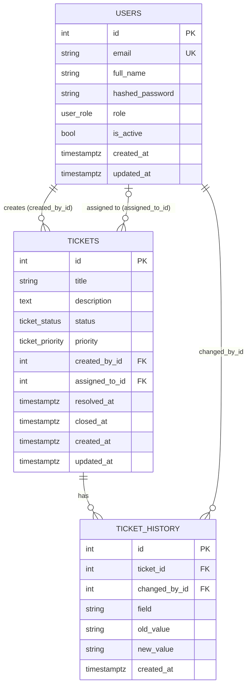

# Database design

PostgreSQL 16, accessed through SQLAlchemy 2.0. Schema changes are managed with Alembic migrations.

## Enums (native PostgreSQL types)

| Type | Values |
|---|---|
| `user_role` | admin, technician, user |
| `ticket_status` | open, in_progress, resolved, closed |
| `ticket_priority` | low, medium, high, critical |

## Foreign keys

| Column | References | On delete |
|---|---|---|
| `tickets.created_by_id` | users.id | RESTRICT (deactivate users instead of deleting) |
| `tickets.assigned_to_id` | users.id | SET NULL (ticket becomes unassigned) |
| `ticket_history.ticket_id` | tickets.id | CASCADE |
| `ticket_history.changed_by_id` | users.id | RESTRICT |

## Check constraints

- `users.email` must be lowercase (uniqueness is therefore case-insensitive).
- `users.full_name` and `tickets.title` must not be blank.
- `resolved` / `closed` tickets must have `resolved_at`; `closed` tickets must have `closed_at`.

Rules that span tables (e.g. "assigned user must be a technician", allowed status transitions) are enforced in the service layer.

## Indexes

`users.email` (unique), `tickets.created_by_id`, `tickets.assigned_to_id`, `(tickets.status, tickets.priority)`, `ticket_history.(ticket_id, created_at)`, `ticket_history.changed_by_id`.
